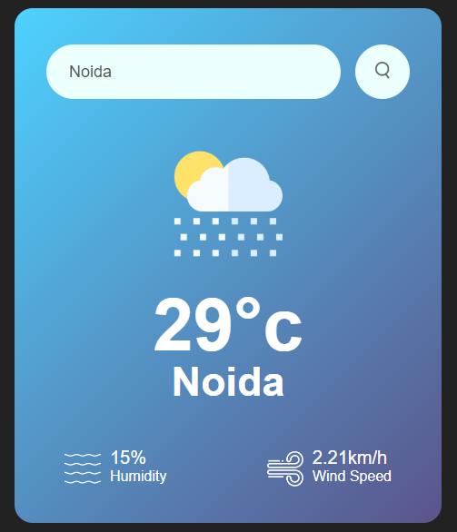

# Weather Application

Welcome to the Weather Application! This project is a web-based application that allows users to search for weather details of a specific city. With a tech stack comprising HTML, CSS, JavaScript, and integration with a weather API, users can access real-time information about temperature, humidity, and wind speed for any location.

## Live Demo

[Live Demo](https://weatherapp-s.netlify.app/)

## Features

- **City Weather Search:** Easily search for weather details of any city.
- **Weather Details:** Display of essential weather information:
  - City Name
  - Temperature (in Celsius)
  - Humidity (in %)
  - Wind Speed (in km/h)

## Technologies Used

- **HTML:** Used for structuring the web content.
- **CSS:** Styling for a user-friendly and responsive design.
- **JavaScript:** Adding interactivity and dynamic behavior.
- **Weather API:** Integration with a weather data provider for real-time weather information.

## Installation

To run the Weather Application locally, follow these steps:

1. Clone the repository:
      (https://github.com/Sakshi0704/WeatherAPP-s/tree/main)

3. Open the project in your preferred code editor.

4. Start a local development server or open the `index.html` file in your web browser.

## Usage

1. Launch the application by opening the `index.html` file in your web browser.

2. Enter the name of the city you want to get weather information for in the search bar.

3. Click the "Search" button to retrieve and display the weather details for the specified city.

4. View the city name, temperature, humidity, and wind speed on the screen.

5. Enjoy accessing real-time weather information for your chosen location!

## Acknowledgments
    Thank you for visiting the Weather Application repository! If you have any questions or suggestions, please feel free to reach out to us through the contact information provided in the repository.

![Weather App Logo] (clouds.png)
